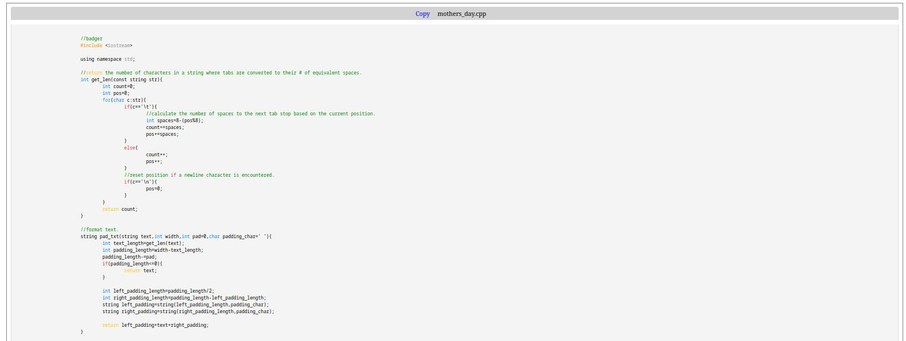

# Code Chat

Website to send code blocks and normal chats to others.

## WARNING

```diff
- WARNING: THIS PROJECT IS VERY EARLY IN DEVELOPMENT :).
+ HOPEFULLY I CAN IMPLEMENT INPUT SANITIZATION(FOR XSS ATTACKS), SQL DATABASES W/ PHP SERVERS, AND ENCRYPTION OF DATA SENT USING SHA AND AES OR SOMETHING.
- RN THOUGH, I'M WORKING ON SYNTAX HIGHLIGHTING OF CODE BLOCKS & GETTING LOCAL FILES TO BE ABLE TO BE SEEN IN CODE BLOCKS.
+ TODO: SEND LOCAL FILES AS CHAT, SO USR. WON'T HAVE TO COPY+PASTE CODE TO SEND.
```

## Available Languages

* Pseudocode
* Javascript
* Python
* Java
* C
* C++
* HTML
* CSS(color specified colors what they would look like)
* C#
* Assembly
* SQL
* Markdown
* Bash
* Tex

## In Action



## TODO

- [x] **Syntax Highlighting**: Get syntax highlighting to work for a multitude of languages.
- [x] **Guess File Extension**: Get file extension from code blocks not defined with code(just filename).
	- Create `pre` & `code` elements & append code from local FTP to code block.
- [] **File Content**: Appending code from local FTP to code block doesn't work since it thinks it's security issue.
	-Tried running by hosting on local server on local machine, but it didn't work.
- [] **PHP**: Change `index.html` to `index.php` to use embedded php code in index file for php server to connect w/ SQL server.
	-Tried it & ran on local server w/ PHP extension on VS Code, but it didn't echo the message w/ inline PHP embedded in `index` file.
- [] **Input Sanitization**: Sanitize input of code blocks and files for XSS attacks.
- [] **SQL Database & PHP Server**: Create PHP server & SQL database after get PHP test code to work with `index.php`.
- [] **Encryption***(optional)*: Encrypt data w/ SHA or AES encryption.